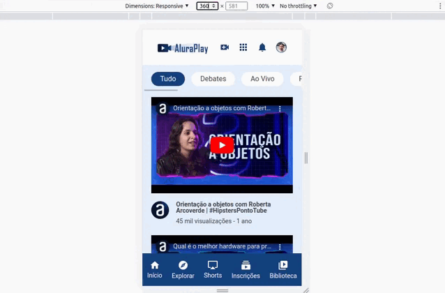

# Alura Books

Desenvolvimento de uma aplicação frontend para simular uma plataforma de vídeos inspirados em uma rede social, sendo integrada como: aluraplay.




## Funcionalidades

- Responsividade para: 1728px / 1024px / 428px
- Menu e Rodapé
- Tópicos com scroll
- Vídeos

## Como utilizar

```bash
# Terminal

git clone https://github.com/MateusMaciel340/aluraplay # clone do repositório

cd aluraplay/ # acessando pasta

# acessar Live Server com index.html
```

## Contribuição

Contribuições são bem-vindas! Se você quiser contribuir com este projeto, por favor, abra uma issue para discutir suas ideias ou envie um pull request com suas alterações.

**Desenvolvedor:** Mateus Maciel - @mateusdev340

## Tecnologias:

- HTML
- CSS

## Licença

Este projeto é licenciado sob a licença Alura Cursos